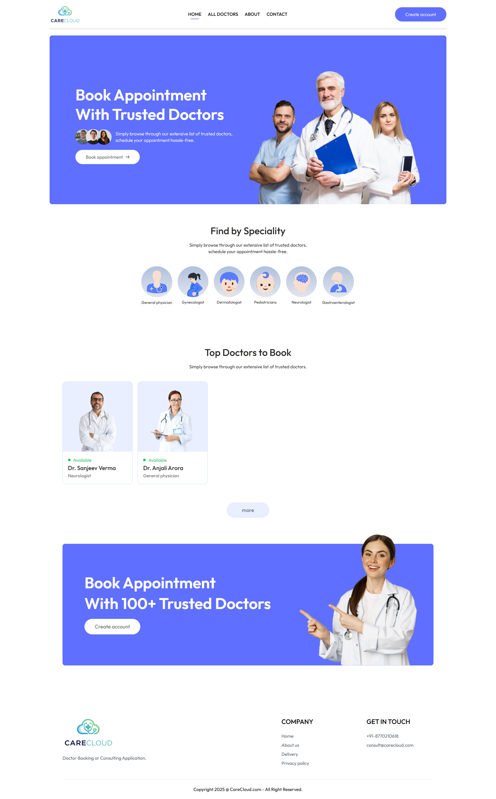
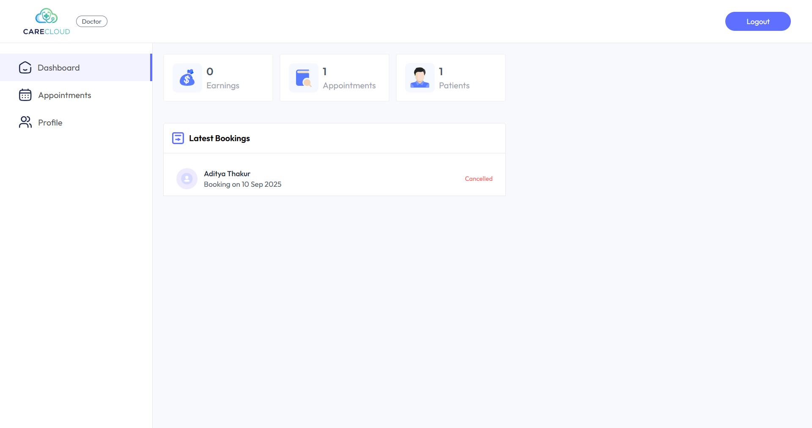
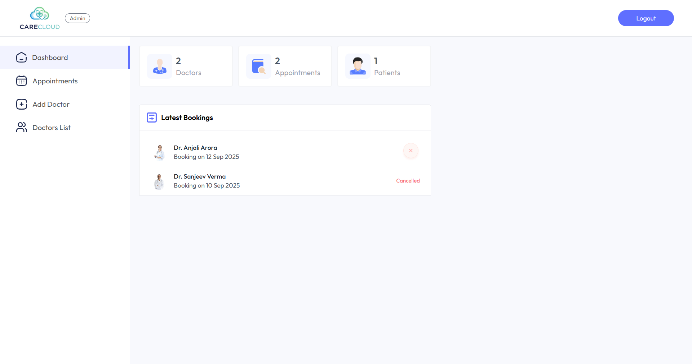

  
# CARECLOUD 👨‍⚕️🏥🤒

It is a comprehensive Hospital Management System built on the MERN stack to enhance hospital operations. This system includes features such as secure user authentication, efficient appointment scheduling, patient record management, and real-time communication between doctors and patients. It provides a scalable and user-friendly platform to streamline healthcare workflows and improve the hospital experience.

 
 

## Features
- **User Authentication**: Secure login for patients, doctors, and administrators.
- **Appointment Scheduling**: Easy booking, rescheduling, and cancellation of appointments.
- **Patient Records Management**: Store, access, and update patient health records.
- **Doctor-Patient Communication**: Real-time messaging for consultations and follow-ups.
- **Admin Dashboard**: Manage users, appointments, and view analytics.
- **Secure Data Storage**: Ensure patient privacy and data security with MongoDB.

 
 

## Tech Stack
- **Frontend**: React.js
- **Backend**: Node.js and Express.js
- **Database**: MongoDB
- **Authentication**: JWT (JSON Web Tokens)
- **State Management**: Redux (optional)

 
 

## LIVE - DEMO 🌐
  
**UI** 👉 [LINK](https://care-cloud.vercel.app)

**Admin Dashboard** 👉 [LINK](https://care-cloud-panel.vercel.app)

 
 

# User Dashboard 👤:

 
 

# Doctor Panel 🧑‍⚕️:

 
 

# Admin Panel 🎯:

